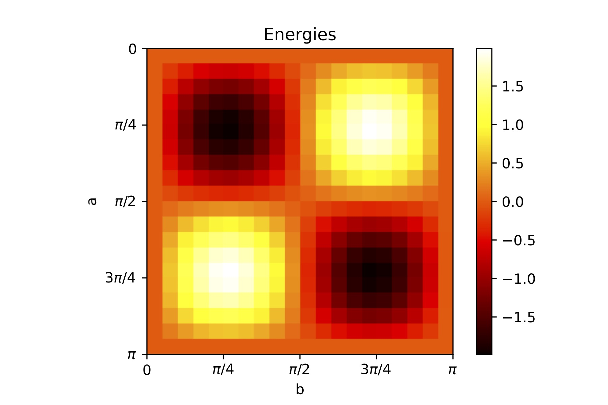

# Simulating quantum many-body dynamics on a current digital quantum computer

**FOPRA 34, June 2022**

The analysis of quantum many-body problems is of utter relevance when aiming to study in depth some of the fundamental quantum mechanical systems. However, in order to do so, it is necessary to deal with the exponential growth in computational resources. Tensor networks have emerged as an ubiquitous tool that can be used to address this challenge.

In this report, we first explain the theory behind the methods here employed such as matrix product state (MPS), time evolution block decimation (TEBD) and dynamic structure factor. With these, the ground state of the Ising model is explored as well as its excited states and the corresponding dynamics such as the time evolution. In addition, these methods allow us to obtain the phase diagram of our Ising hamiltonian with longitudinal and transverse fields as well as the dynamic structure factor.

----
## Authors:
* @Franzvst: Franz Von Silva Tarouca
* @gnandt: Christian Gnandt
* @EmilianoG-byte: Cristian Emiliano Godinez Ramirez